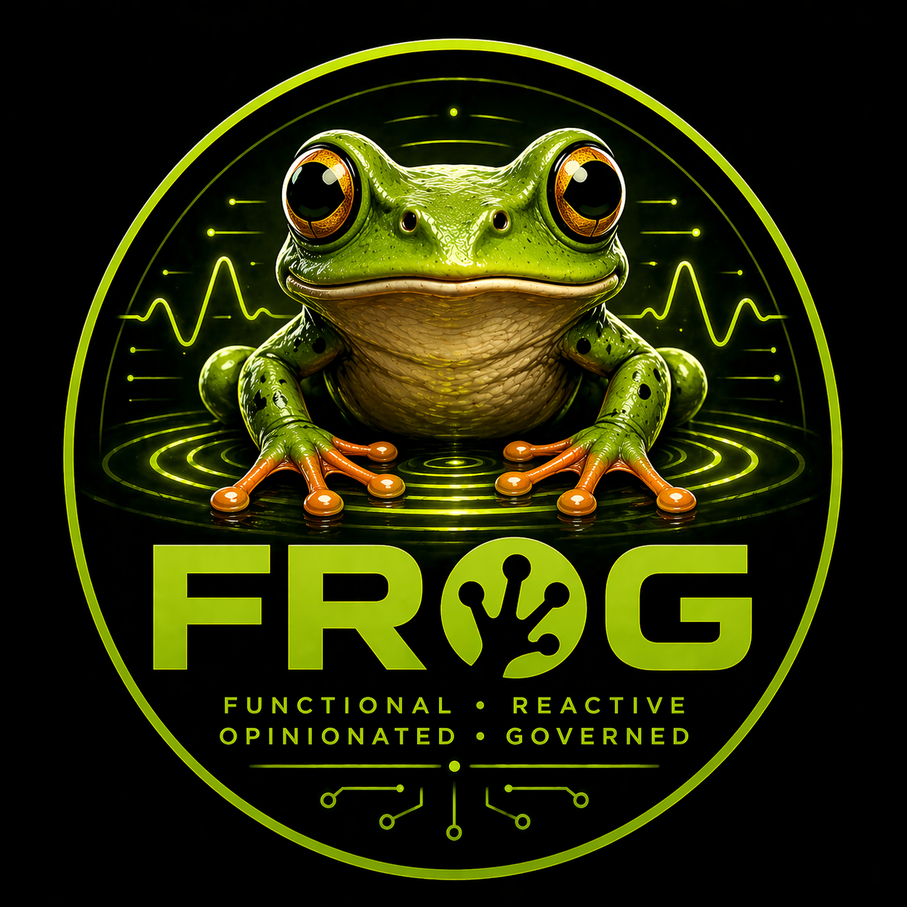

# kLex (The Frog Engine)
kLex is a high-performance, parallel-first scripting language that bridges the gap between the simplicity of a shell and the power of a systems language. By stripping away traditional syntax overhead—such as semicolons—it delivers a lean, low-friction coding experience, while running on a sophisticated engine capable of real multi-core scaling. Frog is built to fully utilize modern hardware, using an asynchronous architecture to handle data processing and streaming workloads efficiently.

kLex is a Go-native, tree-walking interpreter built on the kLex engine. It is designed for developers who value clarity over cleverness, and it follows a core philosophy: Functional, Reactive, Opinionated, and Governed.
The language enforces strict typing with no implicit coercion, and treats errors as first-class values. Its “governed” design emphasizes predictability and explicit behavior, avoiding hidden magic or shorthand that can obscure intent.

Frog was also created to explore a development model better suited to AI-assisted programming. In practice, loosely defined languages can lead even strong language models into ambiguity or inconsistent outputs. By enforcing a more rigid and opinionated structure, Frog aims to improve reliability and reduce those failure modes in human–AI collaboration.
As part of this experiment, the kLex interpreter itself was developed largely through AI-assisted workflows, serving as a real-world test of this approach.

Frog demonstrates the full pipeline of a programming language—Lexer → Parser → AST → Evaluator → Environment. For more detailed documentation, see KLEX_GRAMMAR.MD and KLEX_LANGUAGE.TXT in the docs/ directory.

Architected and designed by Karl McNally. Implementation supported by AI-augmented workflows.

---

<div align="center">
  
</div>

---

## Try it Online

**[Launch the kLex REPL](https://kmcnally5.github.io/FROG/playground/)** — run kLex code directly in your browser, no installation required.

The REPL supports multi-line input (automatically detects when blocks are complete) and maintains session state — define variables and functions, then use them in subsequent lines.

## Editor Support

Syntax highlighting is available for both **Vim** and **VSCode**:

- **VSCode**: Download the extension from [`editors/vscode_froglsp/`](editors/vscode_froglsp/) — follow the included README for installation.
- **Vim**: Download the syntax files from [`editors/vim/`](editors/vim/) — see included instructions for setup.

These syntax plugins provide language-aware highlighting and integrate `.lex` file recognition into your editor.

## Language Server

**froglsp** is the official Language Server Protocol (LSP) implementation for kLex, providing real-time language features in supported editors:

- **Syntax Highlighting** — Context-aware token coloring
- **Error Diagnostics** — Real-time parsing and type-checking
- **Code Completion** — Intelligent suggestions for builtins and symbols
- **Hover Information** — Inline documentation for functions
- **Go-to-Definition** — Jump to function and variable definitions

For installation and configuration instructions, see the **[froglsp README](snowball/froglsp/README.md)**.

## Quick Start

### Prerequisites
- Go 1.16 or later

### Running kLex Programs

```bash
go run . <file.lex>
```

Or build and run directly:

```bash
go build -o klex .
./klex <file.lex>
```

## Language Features

kLex supports a rich set of features:

- **Types:** integer, boolean, string, null, array, function
- **Operators:** arithmetic (`+`, `-`, `*`, `/`), comparison (`==`, `!=`, `<`, `>`, `<=`, `>=`), logical (`&&`, `||`, `!`)
- **Control flow:** `if`/`else`, `while`, `break`, `continue`, `return`
- **Functions:** named and anonymous, closures, strict arity checking
- **Arrays:** literals, indexing, and builtins (`len`, `push`)
- **Null:** first-class keyword with explicit null semantics

## Architecture

The interpreter is organized into focused packages:

```
lexer/lexer.go     — Tokenization with Line/Col stamping
ast/ast.go         — All AST node types and position tracking
parser/parser.go   — Pratt parser producing *ast.Program
eval/object.go     — Runtime object interface and concrete types
eval/env.go        — Environment (lexical scope chain)
eval/typecheck.go  — Type compatibility and error constructors
eval/eval.go       — Main evaluation engine and builtins
main.go            — Entry point (reads .lex file and evaluates)
```

**No external dependencies** — the interpreter is built entirely with the Go standard library.

## Design Principles

kLex enforces a strict, explicit type system:

- **No implicit type coercion** — `1 == "1"` is a type error
- **Explicit null semantics** — `null == null` is true; `null == T` is false for any other type
- **Strict boolean conditions** — only `bool` types are valid in conditionals; integers are not truthy
- **Lexical scoping** — full closure support with proper environment chaining

## Examples

### Recursion and Control Flow
```klex
fn fibonacci(n) {
  if (n <= 1) {
    return n
  }
  return fibonacci(n - 1) + fibonacci(n - 2)
}

println(fibonacci(10))  // 55
```

### Pattern Matching with Enums
```klex
enum Status { Pending Active Completed }

fn label(status) {
  switch status {
    case Status.Pending { return "⏳ Pending" }
    case Status.Active { return "🔄 Active" }
    case Status.Completed { return "✓ Completed" }
  }
}

println(label(Status.Active))  // 🔄 Active
```

### Higher-Order Functions and Pipelines
```klex
numbers = [1, 2, 3, 4, 5]

result = numbers
  |> map(fn(x) { x * 2 })        // [2, 4, 6, 8, 10]
  |> filter(fn(x) { x > 5 })     // [6, 8, 10]
  |> reduce(fn(acc, x) { acc + x }, 0)  // 24

println(result)
```

### Async and Parallel Programming

#### Concurrent Tasks with `async` and `await`
```klex
fn fetchUser(id) {
  user = {}
  user["id"] = id
  user["name"] = "User_" + str(id)
  user["active"] = true
  return user
}

fn fetchPosts(userId) {
  p1 = {}
  p1["postId"] = 1
  p1["userId"] = userId
  p1["title"] = "First Post"
  
  p2 = {}
  p2["postId"] = 2
  p2["userId"] = userId
  p2["title"] = "Second Post"
  
  return [p1, p2]
}

// Launch multiple async tasks in parallel
task1 = async(fn() { return fetchUser(101) })
task2 = async(fn() { return fetchUser(102) })
task3 = async(fn() { return fetchPosts(101) })

// Wait for all results
user1 = await(task1)
user2 = await(task2)
posts = await(task3)

println(user1)
println(posts)
```

#### Lock-Free Atomic Operations for Concurrent Counters
```klex
// Create a lock-free counter array (no mutexes needed)
stats = atomicIntArray(3)

// Process a range of items, updating atomic counters
fn processItems(items, start, end, stats_array) {
  i = start
  while i < end {
    if items[i] > 100 {
      atomicAdd(stats_array, 0, 1)   // high count
    } else if items[i] > 50 {
      atomicAdd(stats_array, 1, 1)   // medium count
    } else {
      atomicAdd(stats_array, 2, 1)   // low count
    }
    i = i + 1
  }
}

items = [150, 75, 30, 120, 55, 10, 200, 45]

// Split work across workers - each processes a different range
task1 = async(fn() { return processItems(items, 0, 4, stats) })
task2 = async(fn() { return processItems(items, 4, 8, stats) })

await(task1)
await(task2)

high   = atomicLoad(stats, 0)
medium = atomicLoad(stats, 1)
low    = atomicLoad(stats, 2)

println("High: " + str(high) + ", Medium: " + str(medium) + ", Low: " + str(low))
```

#### Parallel Reduce with Atomic Aggregation
```klex
fn sumRange(arr, start, end, accumulator) {
  i = start
  result = 0
  while i < end {
    result = result + arr[i]
    i = i + 1
  }
  atomicAdd(accumulator, 0, result)
}

numbers = [1, 2, 3, 4, 5, 6, 7, 8]
total = atomicIntArray(1)

// Parallel reduce: split work across workers
task1 = async(fn() { return sumRange(numbers, 0, 4, total) })
task2 = async(fn() { return sumRange(numbers, 4, 8, total) })

await(task1)
await(task2)

result = atomicLoad(total, 0)
println(result)  // 36
```

#### Streaming with Concurrent Workers
```klex
fn worker(workerId, inputChannel, outputChannel) {
  item, ok = recv(inputChannel)
  while ok {
    // Process: double the value
    processed = {}
    processed["original"] = item
    processed["workerId"] = workerId
    processed["doubled"] = item * 2
    send(outputChannel, processed)
    item, ok = recv(inputChannel)
  }
}

// Create channels with buffer size (allows async sends/recvs without blocking)
input = channel(10)
output = channel(10)

// Launch 4 concurrent workers
numWorkers = 4
workers = makeArray(numWorkers, null)
i = 0
while i < numWorkers {
  workers[i] = async(fn() { return worker(i, input, output) })
  i = i + 1
}

// Feed work into the channel
values = [10, 20, 30, 40, 50]
i = 0
while i < len(values) {
  send(input, values[i])
  i = i + 1
}

// Close input to signal workers that no more work is coming
close(input)

// Collect results from output channel
results = makeArray(len(values), null)
i = 0
while i < len(values) {
  result, ok = recv(output)
  if ok {
    results[i] = result
  }
  i = i + 1
}

// Wait for all workers to finish
i = 0
while i < numWorkers {
  await(workers[i])
  i = i + 1
}

println(results)
```

### Structs with Methods
```klex
struct Point {
  x, y

  fn distance() {
    return sqrt(self.x * self.x + self.y * self.y)
  }

  fn scale(factor) {
    return Point { x: self.x * factor, y: self.y * factor }
  }
}

p = Point { x: 3, y: 4 }
println(p.distance())      // 5
println(p.scale(2).x)      // 6
```

### Closures and First-Class Functions
```klex
fn makeAdder(n) {
  return fn(x) { x + n }
}

add5 = makeAdder(5)
add10 = makeAdder(10)

println(add5(3))   // 8
println(add10(3))  // 13
```

### Strict Type System (No Implicit Coercion)
```klex
// This is strict — no "truthy" integers
if (1) { println("truthy") }  // TypeError: condition must be bool

// Proper boolean checks
if (1 > 0) { println("correct") }  // Works

// Type safety in comparisons
result = 1 == "1"  // TypeError: cannot compare int and string
```

## Full Examples in /tests/

These snippets are excerpted from the test suite. For comprehensive examples and full feature exploration, check out:

- **[`tests/showcaseTest.lex`](tests/unit/showcaseTest.lex)** — The complete FROG Report: enums, structs, pipelines, closures, async/await, HTTP requests, file I/O, JSON parsing, and interactive input. This is the most comprehensive demonstration of the language.
- **[`tests/functionalTest.lex`](tests/unit/functionalTest.lex)** — Higher-order functions: `compose`, `pipe`, `tap`, `partial`, `flip`, and real-world pipeline examples.
- **[`tests/patternTest.lex`](tests/unit/patternTest.lex)** — Enum pattern matching with data binding and exhaustive switch statements.
- **[`tests/httpTest.lex`](tests/unit/httpTest.lex)** — HTTP client usage and async requests.
- **[`tests/fsTest.lex`](tests/unit/fsTest.lex)** — File system operations (read, write, stat).
- **[`tests/arrayTest.lex`](tests/unit/arrayTest.lex)** — Array operations and built-in functions.
- **[`tests/assertTest.lex`](tests/unit/assertTest.lex)** — Assertion and error handling patterns.

## Testing

Test your changes against the included test suite:

```bash
go run . test1.lex
```

## License

This is a learning project. Feel free to explore and learn from the implementation.

MIT License

Copyright (c) 2025 Karl McNally

Permission is hereby granted, free of charge, to any person obtaining a copy
of this software and associated documentation files (the "Software"), to deal
in the Software without restriction, including without limitation the rights
to use, copy, modify, merge, publish, distribute, sublicense, and/or sell
copies of the Software, and to permit persons to whom the Software is
furnished to do so, subject to the following conditions:

The above copyright notice and this permission notice shall be included in all
copies or substantial portions of the Software.

THE SOFTWARE IS PROVIDED "AS IS", WITHOUT WARRANTY OF ANY KIND, EXPRESS OR
IMPLIED, INCLUDING BUT NOT LIMITED TO THE WARRANTIES OF MERCHANTABILITY,
FITNESS FOR A PARTICULAR PURPOSE AND NONINFRINGEMENT. IN NO EVENT SHALL THE
AUTHORS OR COPYRIGHT HOLDERS BE LIABLE FOR ANY CLAIM, DAMAGES OR OTHER
LIABILITY, WHETHER IN AN ACTION OF CONTRACT, TORT OR OTHERWISE, ARISING FROM,
OUT OF OR IN CONNECTION WITH THE SOFTWARE OR THE USE OR OTHER DEALINGS IN THE
SOFTWARE.
