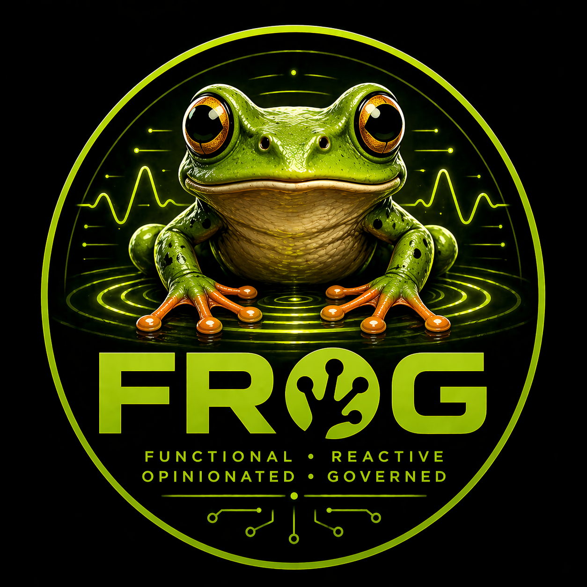
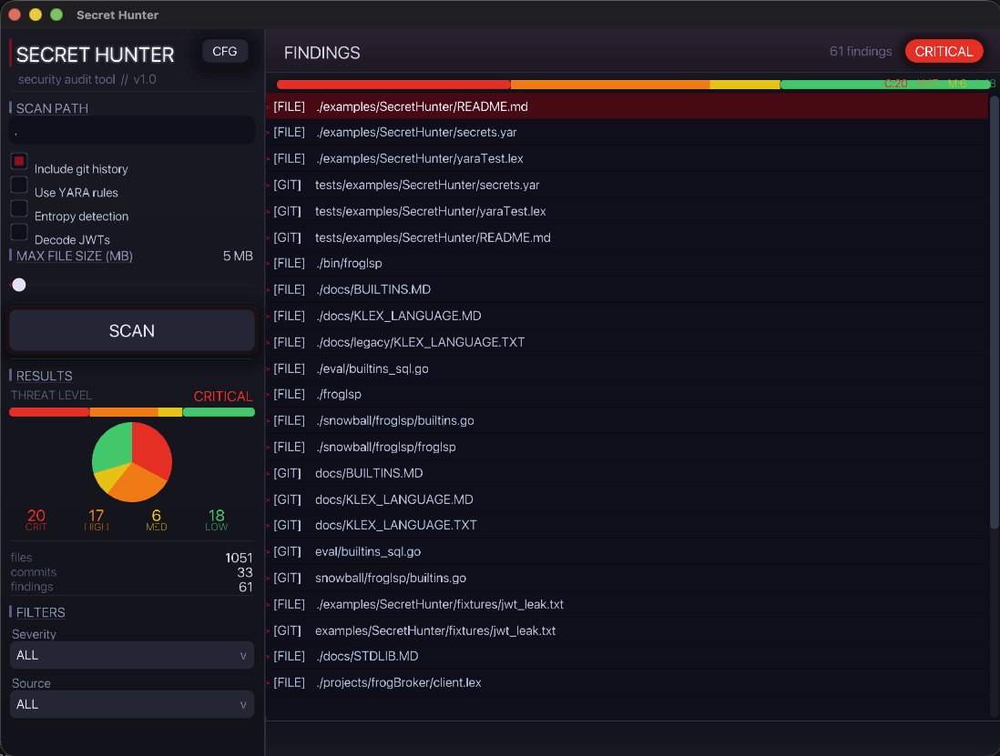
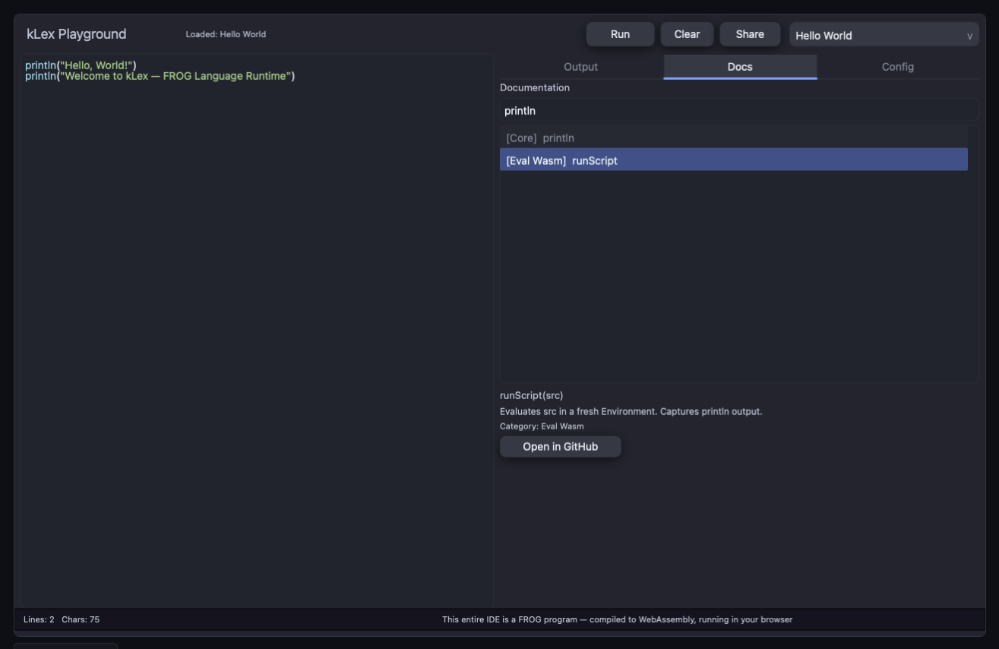
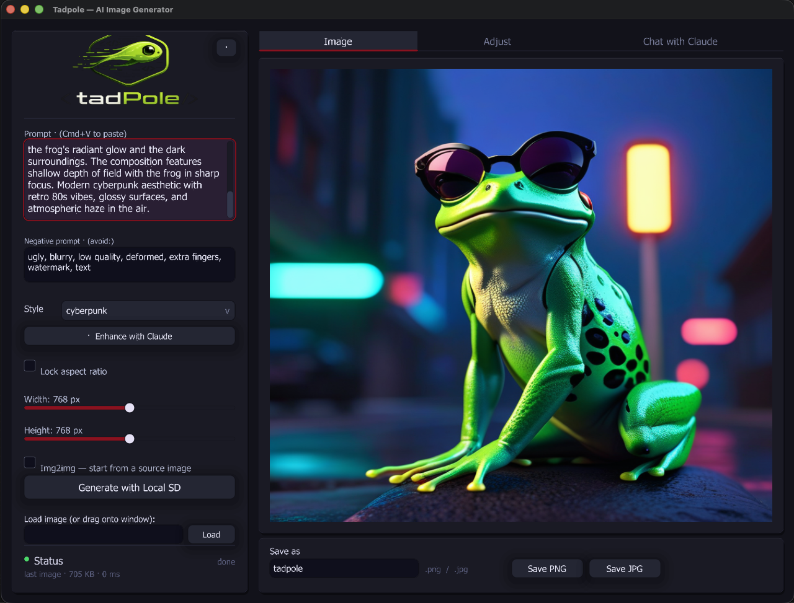

# kLex — FROG Language Runtime

> **A high-performance interpreted language for native tooling, browser applications, cross-language pipelines, and AI-ready concurrent utilities.**

kLex is the reference implementation of FROG — a runtime built for a specific class of program: parallel file scanners, native GUI applications, browser tools, cross-language pipelines, and AI-accelerated concurrent utilities.

It is not a general-purpose language. It is a runtime for people who want to build real tools fast.

---

<div align="center">
  
</div>

---

## What FROG is built for

| Pillar | What it means |
|---|---|
| **Native tooling** | File scanners, credential hunters, pipeline processors |
| **Concurrent desktop utilities** | GUI apps that stay responsive under load |
| **Browser / WASM** | Same scripts, same UI toolkit, running in-browser with no rewrite |
| **Cross-language bridges** | Call Python, Node.js, or any subprocess from FROG with a typed schema and streaming |
| **AI / ML primitives** | Tensor ops, embeddings, and model inference baked into the runtime |
| **High-throughput scripting** | Parallel workloads without a compiled toolchain |
| **Immediate-mode GUI** | OpenGL on desktop, Canvas2D in the browser — same widget code |
| **Channel-oriented concurrency** | Channels are a language primitive, not a library add-on |

---

## Secret Hunter — credential scanner with native GUI

A full parallel security scanner built entirely in FROG. Scans codebases and git history for leaked API keys, passwords, and tokens. Ships a live OpenGL interface with real-time progress, severity distribution, and filtering.

```bash
./klex examples/SecretHunter/secretHunterUI.lex
```

40 parallel workers. Native OpenGL GUI at 60fps during scan. Built in ~900 lines of FROG.

> A scripted scanner with a native GUI and parallel async channels — in an interpreted language.

---

## Try it Online

**[Launch the kLex REPL](https://kmcnally5.github.io/FROG/)** — run FROG code directly in your browser, no installation required. Multi-line input, persistent session state, full stdlib. Powered by the WASM build — [see below](#wasm--frog-in-the-browser).

---

## Screenshots

<p align="center">
  <a href="docs/images/screenshot2.png"></a>
  &nbsp;
  <a href="docs/images/screenshot1.png"></a>
  &nbsp;
  <a href="docs/images/screenshot3.png"></a>
</p>

<p align="center">
  <em>Secret Hunter (native OpenGL GUI)</em>
  &nbsp;&nbsp;&nbsp;&nbsp;&nbsp;&nbsp;&nbsp;&nbsp;&nbsp;&nbsp;&nbsp;&nbsp;&nbsp;&nbsp;&nbsp;&nbsp;
  <em>kLex Playground (browser · WASM)</em>
  &nbsp;&nbsp;&nbsp;&nbsp;&nbsp;&nbsp;&nbsp;&nbsp;&nbsp;&nbsp;&nbsp;&nbsp;&nbsp;&nbsp;&nbsp;&nbsp;
  <em>tadPole AI image generator</em>
</p>

---

## Three things that make it different

### 1 — Async and channels

```lex
let jobs    = channel(200)
let results = channel(200)

let worker = async(fn() {
    while true {
        let job, ok = recv(jobs)
        if ok == false { break }
        send(results, job + " processed")
    }
})

send(jobs, "file.txt")
let result, ok = recv(results)
println(result)
```

No executors, no event loops. Each `async()` spawns a real goroutine. Channels are typed, bounded, and blocking.

### 2 — Native OpenGL GUI, built in

```lex
let font = loadFont("/System/Library/Fonts/SFNS.ttf", 18)

window(800, 600, "App", fn(frame) {
    background(0.07, 0.07, 0.10)
    fill(0.40, 0.82, 1.00, 1.0)
    circle(mouseX(), mouseY(), 20.0)
    textFont(font, "Hello.", 40, 40, 1.2)
})
```

SDF-rendered shapes and text. 8× MSAA. Immediate-mode widget system. Runs at native speed via go-gl.

> **Platform note:** Graphics and UI run on macOS, Linux, and Windows. Cross-compiling Windows binaries from macOS requires `mingw-w64`; native builds use whatever C toolchain the host platform provides (Xcode on macOS, gcc on Linux, MSYS2 or TDM-GCC on Windows).

### 3 — No implicit behaviour, ever

```lex
1 == "1"     // TypeError — no coercion
if 1 { }     // TypeError — integer is not a boolean
let x = null     // explicit null, not an error
```

No hidden type coercion. No implicit threading. No magic. Every behaviour in a FROG program is declared.

---

## Install

Requires Go 1.26+.

```bash
git clone https://github.com/kmcnally5/FROG
cd FROG
go build -o klex .
./klex your_program.lex
```

The built `klex` binary auto-discovers `stdlib/` next to itself, so scripts that `import "stdlib/..."` work from any directory — no `KLEX_PATH` configuration needed when the binary and stdlib stay together.

### Build the full toolchain

`go build -o klex .` is all you need to run programs. To build the interpreter **and** every bundled tool (`klexfmt`, `tapetool`, `kpkg`, `froglsp`, the WASM generators, …) in one shot, use the cross-platform builder:

```bash
go run ./tools/build          # klex + all tools → ./bin/
go run ./tools/build --wasm   # also build the WASM playground bundle → ./bin/klex.wasm
go run ./tools/build --list   # show what would be built, without compiling
```

It's a small Go program (no make, no shell scripts — works identically on Windows, Linux, and macOS) that discovers the tools by scanning the source tree, so it never goes out of date. The output `bin/` directory is generated build output and is gitignored — nothing in it ships; you rebuild it from source whenever you like.

---

## Core language

```lex
// Functions are first-class
fn add(a, b) { return a + b }
println(add(3, 4))   // 7

// Arrays and hashes
let points = [{"x": 1, "y": 2}, {"x": 3, "y": 4}]
println(points[0]["x"])   // 1

// Parallel processing — fan out work across async tasks
fn scan(chunk) { return len(chunk) }

let slices = ["alpha", "beta", "gamma"]
let n      = len(slices)
let tasks  = makeArray(n, null)
let i      = 0
while i < n {
    let chunk = slices[i]
    tasks[i] = async(fn() { return scan(chunk) })
    i = i + 1
}
let counts = makeArray(n, null)
let j = 0
while j < n {
    counts[j] = await(tasks[j])
    j = j + 1
}
println(counts)   // [5, 4, 5]

// Error handling — Go-style, no exceptions
fn riskyCall(x) { return x * 2 }
let result, err = safe(riskyCall, 21)
if err != null { println(err) }
println(result)   // 42
```

**Types:** integer, float, boolean, string, null, array, hash, tuple, channel, function, struct, enum, task

**Concurrency:** `async` / `await` / `channel` / `send` / `recv` / `select` / `atomicIntArray` / `atomicFloatArray`

---

## Language Server (froglsp)

`froglsp` is a full LSP server for FROG, built from the ground up for the language. Source lives in `snowball/froglsp/`.

**Capabilities:**

| Feature | Detail |
|---|---|
| Completion | Symbol, module-member (`.`), and builtin completions with snippet tab-stops |
| Signature help | Parameter hints on `(` and `,` — tracks the active argument as you type |
| Hover | Inline docs for builtins, user-defined functions, and imported module members |
| Go to definition | Jump to where a symbol is declared |
| Diagnostics | Parser errors and a static lint pass surfaced in-editor as you type |
| Document symbols | Outline view of all functions and declarations in the file |
| Formatting | Full document formatting via the built-in `klexfmt` formatter |
| Code actions | Quick-fixes for lint diagnostics |

The VS Code extension (`editors/vscode_froglsp/`) configuration wires the server up automatically — install the extension, open a `.lex` file, and all features are active with no additional configuration.

---

## Bytecode VM

kLex includes a bytecode compiler and VM. Rather than walking the AST node-by-node at runtime, the compiler translates your program to a compact instruction set that the VM dispatches in a tight flat loop — no recursion, no interpreter overhead per node.

Enable it with `--vm`:

```bash
./klex --vm your_program.lex
```

The VM delivers the most noticeable gains on compute-heavy workloads: tight arithmetic loops, deep recursion, and programs that call functions millions of times. Programs that spend most of their time in I/O, channels, or the graphics pipeline see smaller differences since those paths run in native Go regardless.

The VM is under active development. The vast majority of the language is supported; a small number of constructs (`select`, some advanced async patterns) are not yet implemented in the compiler.

---

## WASM — FROG in the Browser

kLex compiles to WebAssembly (`GOOS=js GOARCH=wasm`). The same language that drives a native GPU-accelerated scanner runs directly in a browser tab, no installation required.

```bash
cd examples/playground && ./serve.sh   # build + serve in one step
```

| Capability | How it works |
|---|---|
| **Zero-install distribution** | Paste a URL, run FROG — no package manager, no friction |
| **Full UI toolkit** | 35+ widgets (buttons, tables, charts, text input) via Canvas2D — identical code to the desktop |
| **Embedded stdlib** | Every stdlib module is baked into the binary; `import "stdlib/json.lex"` resolves from memory |
| **OPFS persistence** | `opfs://` URL scheme gives scripts persistent sandboxed storage; survives page reloads |
| **Persistent REPL + isolated VM** | `klex_eval` keeps session state; `runScript` runs a fresh VM environment per call |
| **Worker bridge** | Call any JS library from FROG via Web Workers — same bridge API as desktop subprocesses |
| **JS interop** | Three exports: `klex_eval`, `klex_reset`, `klex_depth` |

Filesystem I/O, subprocesses, Metal/tensor, and database drivers are unavailable in the browser sandbox. Everything else runs as-is.

Full details: [docs/WASM.MD](docs/WASM.MD).

---

## Cross-language Bridges

FROG scripts call Python, Node.js, or any subprocess directly via the bridge protocol — typed JSON-over-stdio with schema introspection, streaming, and backpressure. The calling side is three lines:

```frog
let bridge, err = bridgeOpen("./my_bridge.py")
let result, err = bridgeCall(bridge, "analyse", [data])
bridgeClose(bridge)
```

The bridge worker handles type validation, streaming responses, and cancellation automatically. In the browser, the same API maps to Web Workers — call any JS library from kLex without leaving FROG.

---

## Agentic Hooks — the Runtime Talks Back

FROG programs are observable. Every significant runtime event fires through a structured hook layer that external tools — including LLMs — can watch in real time.

| Hook | Fires when |
|---|---|
| `error` | A TypeError or RuntimeError is raised |
| `async_spawn` | An `async()` call creates a new task |
| `async_done` | A task completes |
| `ui_event` | A widget fires a user interaction |
| `bridge` | A native bridge call is made or returns |

Every event carries a `caused_by` ID — the full causal graph of a concurrent program is reconstructable without touching the source.

### `--record-tape`

```bash
go run ./tools/tapetool record my_app.lex
go run ./tools/tapetool show my_app-20260529.lextape --filter error   # usually all you need
```

### LLM-assisted remote debugging

The tape streams as the program runs. An LLM can observe a live FROG app while a human drives the UI — no source changes, no rebuild:

```bash
KLEX_PATH=. go run ./tools/tapetool record --output /tmp/debug.lextape my_app.lex
tail -f /tmp/debug.lextape | grep --line-buffered '"kind":"error"'
```

**Real example:** SecretHunter's UI was flickering on every frame. A one-minute tape session caught `progressBar expects 7 arguments` firing at 60fps — silently aborting the render loop mid-draw, every frame. The same mechanism caught a 2310-errors-per-second storm in another app that looked like an unresponsive UI from the outside.

It turns out "give an AI a live window into your program's runtime" is an unreasonably effective debugging strategy.

---

## Why kLex exists

Most interpreted languages treat concurrency as an afterthought — async/await sugar over an event loop, or a GIL that makes threading a lie. FROG treats concurrency as the execution model.

The question kLex was built to answer:

> Can a lightweight tree-walking interpreter power real native applications — desktop tools, parallel scanners, live GUIs — without the overhead of a compiled toolchain?

The answer is yes.

The work that went into kLex is not syntax design. It is:

- **Scheduler design** — real goroutine-backed tasks, not cooperative coroutines
- **Graphics systems** — SDF rendering pipeline, MSAA, immediate-mode layout
- **Async runtime architecture** — environment snapshots eliminate mutex contention across task boundaries
- **Performant tooling pipelines** — parallel workers, atomic arrays, bounded channels
- **Coherent application model** — one concurrency model, not fourteen

The restraint is intentional. No decorators, no metaclasses, no reactive state systems, no giant framework abstractions. The simplicity is a feature. The moment kLex becomes a kitchen-sink language is the moment it stops being useful for the thing it is actually good at.

---

## Design principles

- **Explicit over implicit** — if it happens, you wrote it
- **Channels over shared memory** — coordinate by passing values
- **Strict types** — no coercion, ever
- **Array-first** — flat data structures, parallel processing
- **Low magic** — the runtime does what you can read

---

## Testing status

**macOS** is the primary development platform. Every release passes the full master test suite before tagging.

**WASM** — 59/90 unit tests pass under `go run ./tools/wasmsmoke`. The 31 failures are pre-existing platform limitations (filesystem, subprocess, database, Metal/tensor) — not interpreter bugs.

**Windows** — v0.3.35 passes 45 of 47 stdlib tests on a fresh install (the two failures are test-content portability issues, not interpreter bugs). v0.3.37 is untested on Windows.

**Linux** — v0.3.35 has been verified and is working. v0.3.37 is untested on Linux.

If you hit anything platform-specific, a GitHub issue with reproduction steps is the fastest way to get it looked at.

---

## Project Structure

| Folder | Purpose |
|---|---|
| `ast/` | AST node types |
| `cmd/` | CLI entry-point helpers |
| `docs/` | Language and library documentation |
| `editors/` | Editor integrations (VSCode extension) |
| `eval/` | Tree-walking evaluator and all builtins |
| `examples/` | Runnable example programs |
| `formatter/` | Source code formatter |
| `lexer/` | Tokeniser |
| `parser/` | Pratt parser |
| `repl/` | Interactive REPL |
| `snowball/` | Developer and build-time tooling |
| `stdlib/` | Standard library — `.lex` files |
| `tests/` | Test suite |
| `tools/` | Source for kLex-specific CLI tools |
| `vm/` | Bytecode compiler and VM (experimental) |

---

## License

MIT — Copyright © 2025 Karl McNally
